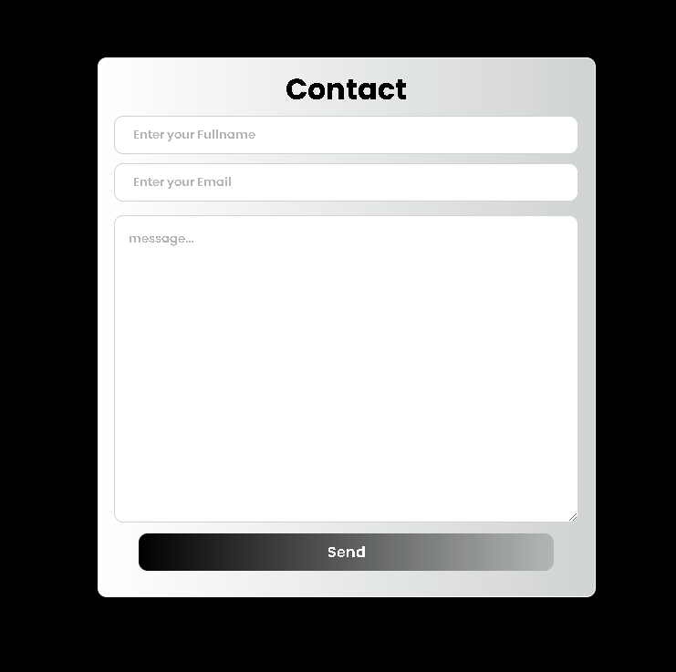

# PHP101 From Contact

```
This PHP Project Create for My Portfolio
```

##### Create file php for create from contact

Create UI(User Interface) use HTML `contact.php`

```html 
<!DOCTYPE html>
<html lang="en">
<head>
    <meta charset="UTF-8">
    <meta name="viewport" content="width=device-width, initial-scale=1.0">
    <title>Contact pages</title>
    <link rel="stylesheet" href="style.css">
</head>
<body>
    <div class="container">
        <h1 class="topic-contact">contact</h1>
        <form action="" method="post" class="form-contact">
            <input type="text" placeholder="Enter your Fullname" name="fullname">
            <input type="email" placeholder="Enter your Email" name="emailName">
            <textarea name="message" placeholder="message..."></textarea>
            <button type="submit" name="nameButton">send</button>
        </form>
    </div>
</body>
</html>
```

File `Style.css`

```css
@import url("https://fonts.googleapis.com/css2?family=Poppins:ital,wght@0,100;0,200;0,300;0,400;0,500;0,600;0,700;0,800;0,900;1,100;1,200;1,300;1,400;1,500;1,600;1,700;1,800;1,900&display=swap");
* {
  margin: 0 auto;
  padding: 0 auto;
  box-sizing: border-box;
}
body {
  display: flex;
  transition: all 0.3s ease;
  font-style: normal;
  font-family: "Poppins", sans-serif;
  font-weight: 100;
  flex-direction: column;
  background-color: #000000;
}

div.container {
  width: 60vh;
  height: 65vh;
  border: #ffffff 1px solid;
  display: flex;
  background: linear-gradient(to left, #d0d3d4, #ffffff);
  margin-top: 140px;
  transition: all 0.3s eases;
  border-radius: 10px;
  flex-direction: column;
  & h1.topic-contact {
    transition: all .3s ease;
    text-align: center;
    margin-top: 10px;
    text-transform: capitalize;
  }
  & form.form-contact {
    display: flex;
    transition: all .3s ease;
    flex-direction: column;
    & input {
        width: 56vh;
        height: 4vh;
        margin: 5px;
        border: #d0d3d4 1px solid;
        cursor: pointer;
        outline: none;
        padding: 20px;
        transition: all .3s ease;
        font-family: "Poppins", sans-serif;
        font-weight: 550;
        border-radius: 10px;
    }
    ::placeholder {
        color: #b3b6b7;
    }
    & textarea {
        width: 56vh;
        height: 37vh;
        border: #d0d3d4 1px solid;
        cursor: pointer;
        outline: none;
        padding: 15px;
        margin-top: 10px;
        transition: all .3s ease;
        font-family: "Poppins", sans-serif;
        font-weight: 550;
        border-radius: 10px;
    }
    & button {
        width: 50vh;
        color: #ffffff;
        height: 4.5vh;
        border: none;
        cursor: pointer;
        outline: none;
        font-size: 16px;
        margin-top: 12px;
        background: linear-gradient(to right, #000000, #b3b6b7);
        transition: all .3s ease;
        font-family: "Poppins", sans-serif;
        font-weight: 600;
        border-radius: 10px;
        text-transform: capitalize;
    }
    & button:hover {
        background: linear-gradient(to right, #b3b6b7, #000000);
    }
  }
}
```

Create connection and qury data to database
File `contact.php`

```php
<?php  
    $connect = mysqli_connect("localhost", "root", "", "data");

    if(isset($_POST["nameButton"])) {
        $fullname = $_POST["fullname"];
        $email = $_POST["emailName"];
        $textareas = $_POST["message"];

        $qury = "INSERT INTO contact_user VALUES('', '$fullname', '$email', '$textareas')";

        mysqli_query($connect, $qury);
    }
?>
```

File `contact.php` to create connection to database

```php
$connect = mysqli_connect("localhost", "root", "", "data");
```

Check value input and send value method POST

```php
if(isset($_POST["nameButton"])) {
        $fullname = $_POST["fullname"];
        $email = $_POST["emailName"];
        $textareas = $_POST["message"];

        $qury = "INSERT INTO contact_user VALUES('', '$fullname', '$email', '$textareas')";

        mysqli_query($connect, $qury);
    }
```

Query data to database

```php
$qury = "INSERT INTO contact_user VALUES('', '$fullname', '$email', '$textareas')";
```

Use function `mysqli_query()` to database and Query data

```php
mysqli_query($connect, $qury);
```

#### Result



In Database

